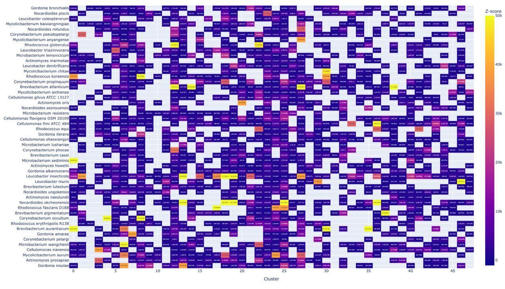

# hse22_project_group_Actinobacteria
Итоговый проект по Биоинформатике, групповая часть

| Участник | Род | Ссылка на индивидуальную часть |
| ------ |-----| -----|
|Бардонов	Даниил | Leucobacter | https://github.com/dabardonov/hse22_project |
|Васильева	Виктория |  Bifidobacterium | https://github.com/viktoria210/hse22_project |
|Гильманова	Далия | Brevibacterium | https://github.com/da11a/hse22_project |
|Долгодворова	Мария |  Actinomyces | https://github.com/knapweedss/hse22_project_Actinomyces |
|Коган	Евгений | Corynebacterium | https://github.com/mondique/hse22_project |
|Темкин	Влад | Gordonia | https://github.com/zlatovladdka/hse22_project |
|Шишкин	Михаил | Cellulomonas | https://github.com/TesMichelle/hse22_project_minor |
|Ширма	Кирилл |Nocardioides | https://github.com/ruct/hse22_bioinfo_project |
|Валиев	Алы | Mycolicibacterium | https://github.com/Kalick153/hse22_project|
|Свинцов Михаил | Microbacterium | https://github.com/SvMixa/hse22_project|
|Богданов Данила  | Rhodococcus | https://github.com/Sunflower47/hse22_project|

### [Презентация](https://docs.google.com/presentation/d/1vLEMij1sUKjF-VS2CkVkbWrX1rBbscDmZzMmHYSArlI/edit#slide=id.g13510f3057f_2_5)

### [Ссылка на групповой colab](https://colab.research.google.com/drive/1vDN8I0Sv7V2_vPfEJi_dsVLNZ8iT7a9s?usp=sharing)

### [Ссылка на результаты proteinortho](https://drive.google.com/file/d/1_CfLk_IHBtOkBgqJis75tJ711DLbvs3x/view?usp=sharing)
### [Colab с визуализацией Z-ДНК и подготовкой файлов для выравнивания](https://colab.research.google.com/drive/1-2Xgji44ccVU7_Z7okIGYO_Z4GO7Zl8f?usp=sharing)

## Heatmap

## Визуализация расположения участков Z-DNA
