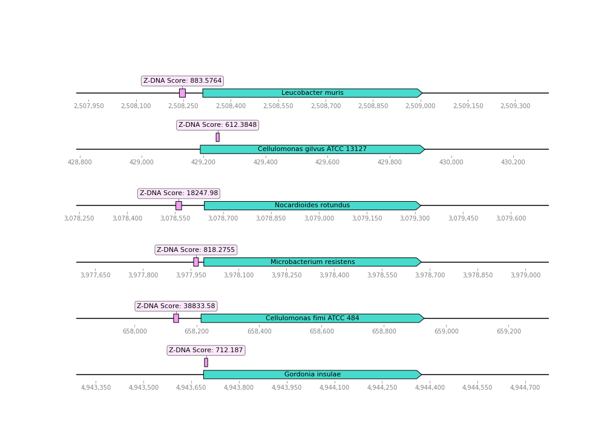
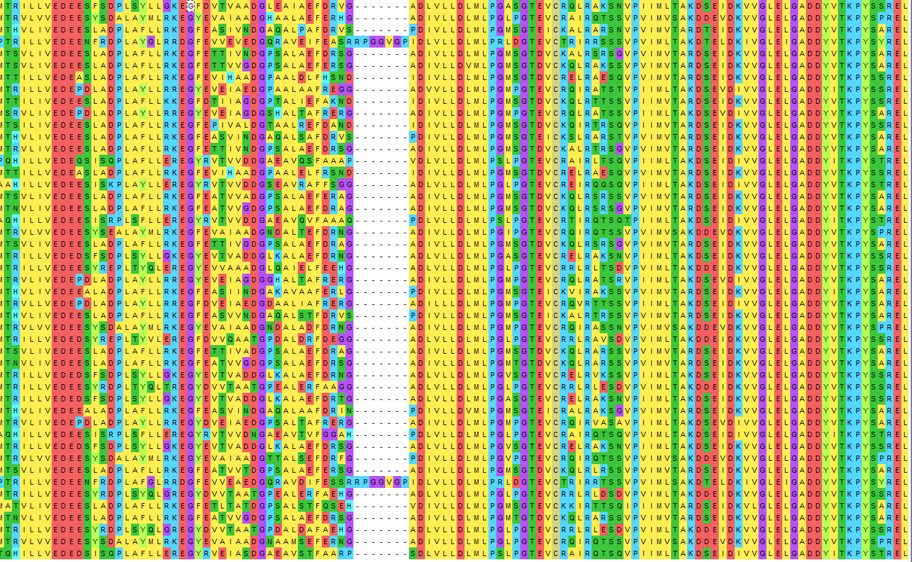

# hse22_project_group_Actinobacteria
Итоговый проект по Биоинформатике, групповая часть

| Участник | Род | Ссылка на индивидуальную часть |
| ------ |-----| -----|
|Бардонов	Даниил | Leucobacter | https://github.com/dabardonov/hse22_project |
|Васильева	Виктория |  Bifidobacterium | https://github.com/viktoria210/hse22_project |
|Гильманова	Далия | Brevibacterium | https://github.com/da11a/hse22_project |
|Долгодворова	Мария |  Actinomyces | https://github.com/knapweedss/hse22_project_Actinomyces |
|Коган	Евгений | Corynebacterium | https://github.com/mondique/hse22_project |
|Темкин	Влад | Gordonia | https://github.com/zlatovladdka/hse22_project |
|Шишкин	Михаил | Cellulomonas | https://github.com/TesMichelle/hse22_project_minor |
|Ширма	Кирилл |Nocardioides | https://github.com/ruct/hse22_bioinfo_project |
|Валиев	Алы | Mycolicibacterium | https://github.com/Kalick153/hse22_project|
|Свинцов Михаил | Microbacterium | https://github.com/SvMixa/hse22_project|
|Богданов Данила  | Rhodococcus | https://github.com/Sunflower47/hse22_project|

### [Презентация](https://docs.google.com/presentation/d/1vLEMij1sUKjF-VS2CkVkbWrX1rBbscDmZzMmHYSArlI/edit#slide=id.g13510f3057f_2_5)

### [Ссылка на групповой colab](https://colab.research.google.com/drive/1vDN8I0Sv7V2_vPfEJi_dsVLNZ8iT7a9s?usp=sharing)

### [Ссылка на результаты proteinortho](https://drive.google.com/file/d/1_CfLk_IHBtOkBgqJis75tJ711DLbvs3x/view?usp=sharing)
### [Colab с визуализацией Z-ДНК и подготовкой файлов для выравнивания](https://colab.research.google.com/drive/1-2Xgji44ccVU7_Z7okIGYO_Z4GO7Zl8f?usp=sharing)

## Heatmap

### Описание функций выбранных кластеров

**Кластер 1 (149)
23S rRNA (guanosine(2251)-2'-O)-methyltransferase RlmB:**

Представляет собой фермент с систематическим названием S-аденозил-L-метионин:23S рРНК (гуанозин2251-2'-O-)-метилтрансфераза. Фермент катализирует метилирование гуанозина

**Кластер 2 (424)
Asp-tRNA(Asn)/Glu-tRNA(Gln) amidotransferase subunit GatA:**

Asp-тРНК(Asn)/Glu-тРНК(Gln) субъединица амидотрансферазы GatA, трансфераза

**Кластер 3 (406)
ATP-dependent DNA helicase RecG:**

Играет решающую роль в рекомбинации и репарации ДНК.

**Кластер 4 (828)
twin-arginine translocase subunit TatC:**

Отвечает за экспорт свернутых белков через цитоплазматическую мембрану бактерий.

**Кластер 5 (138)
phosphoribosylformylglycinamidine synthase subunit PurQ:**

Часть фосфорибозилформилглицинамидинсинтазного комплекса, участвующего в пути биосинтеза пурина. Катализирует АТФ-зависимое превращение формилглицинамид рибонуклеотида (FGAR) и глутамина с образованием формилглицинамидин рибонуклеотида (FGAM) и глутамата

**Кластер 6 (428)
UMP kinase:**

Этот фермент относится к семейству трансфераз, в частности к тем, которые переносят фосфорсодержащие группы (фосфотрансферазы) с фосфатной группой в качестве акцептора, и участвует в метаболизме пиримидина.

**Кластер 7 (169)
NUDIX hydrolase:**

Гидролазы NUDIX представляют собой суперсемейство гидролитических ферментов, способных расщеплять нуклеозиддифосфаты, связанные с x (любой фрагмент). Субстраты, гидролизуемые ферментами nudix, включают широкий спектр органических пирофосфатов, включая ди- и трифосфаты нуклеозидов, динуклеозидные и дифосфоинозитол-полифосфаты, нуклеотидные сахара и РНК-шапки с различной степенью специфичности к субстрату

**Кластер 8 (111)
demethylmenaquinone methyltransferase:**

Деметилменахинонметилтрансфераза представляет собой фермент с систематическим названием S-аденозил-L-метионин: деметилменахинонметилтрансфераза. Фермент катализирует последнюю стадию биосинтеза менахинона.

**Кластер 9 (479)
ribonuclease J:**

Прокариотическая рибонуклеаза, присутствующая примерно у половины всех видов бактерий, включая ряд важных патогенов, играет ключевую роль как в процессинге, так и в деградации РНК

**Кластер 10 (477)
CDP-diacylglycerol--glycerol-3-phosphate 3-phosphatidyltransferase:**

CDP-диацилглицерин-глицерин-3-фосфат-3-фосфатидилтрансфераза. Данный белок катализирует первую стадию синтеза кислых фосфолипидов.

## Визуализация расположения участков Z-DNA
6 кластер на большой тепловой карте

## Выравнивание

